<div align="center">
  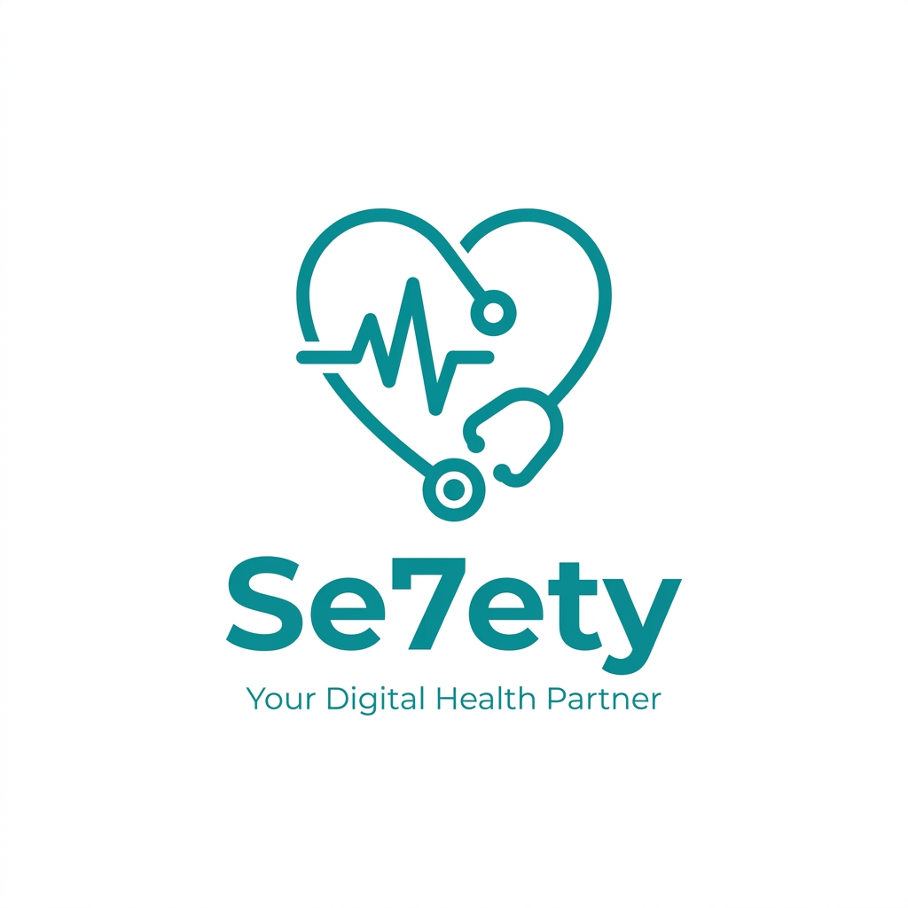
  <h1>Se7ty (صحّتي)</h1>
  <p>A comprehensive healthcare application for booking doctor appointments and managing profiles for both patients and doctors.</p>
</div>

---

## 🌟 Features

### 👨‍⚕️ For Doctors
- Create an account and verify credentials.
- Add specialization, working hours, contact info, and clinic details.
- View and manage patient appointments.
- Manage personal profile and ratings.

### 🤒 For Patients
- Register a new account and manage personal information.
- Browse doctors by specialization (Dentistry, Ophthalmology, Cardiology, etc.).
- View top-rated doctors.
- Detailed doctor profiles including ratings, working hours, and location.
- **Smart Dynamic Booking System:** Automatically generates available time slots based on the doctor's specific working hours.
- View and manage booked appointments.

## 🎥 App Demo

> **Note for Developer:** Record a quick video or GIF of the app in action and replace `assets/demo.gif` with your actual file.

<div align="center">
  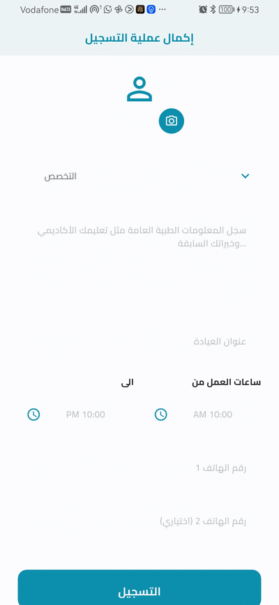
</div>

## 📸 Screenshots

<p align="center">
  
  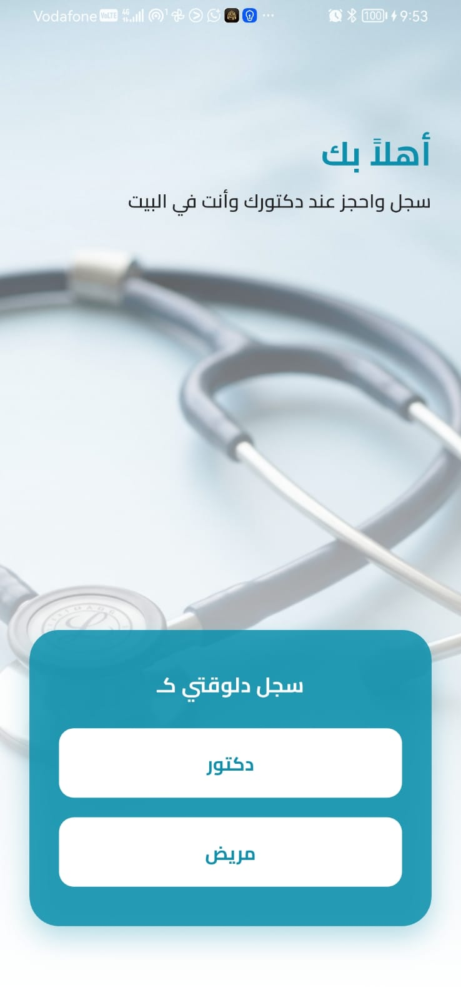
  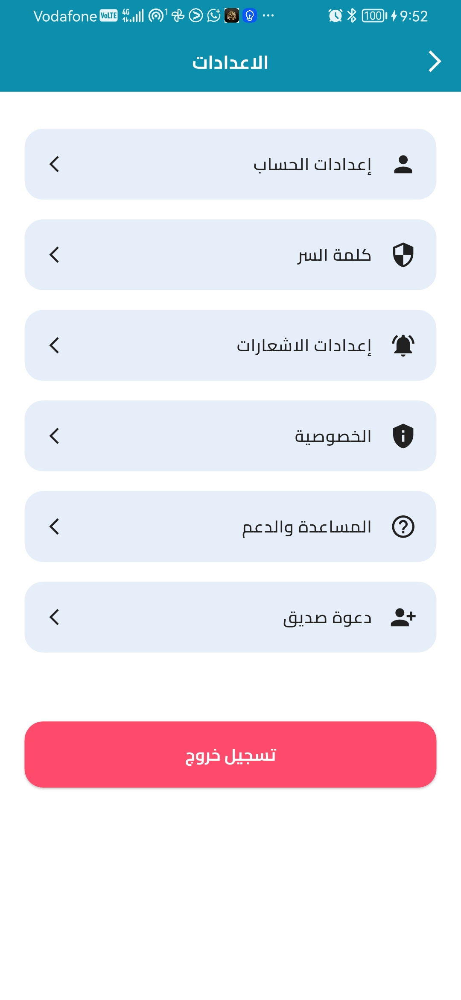
</p>
<p align="center">
  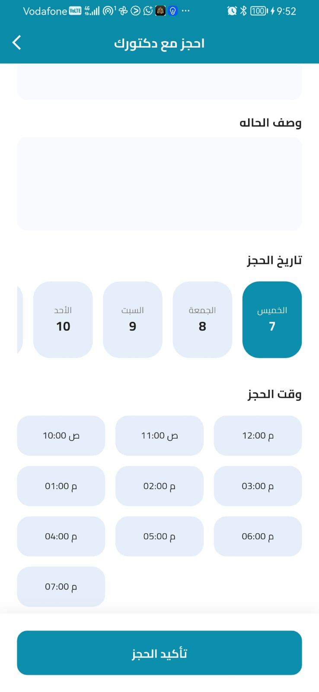
  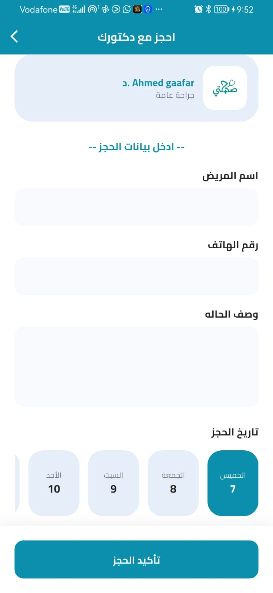
  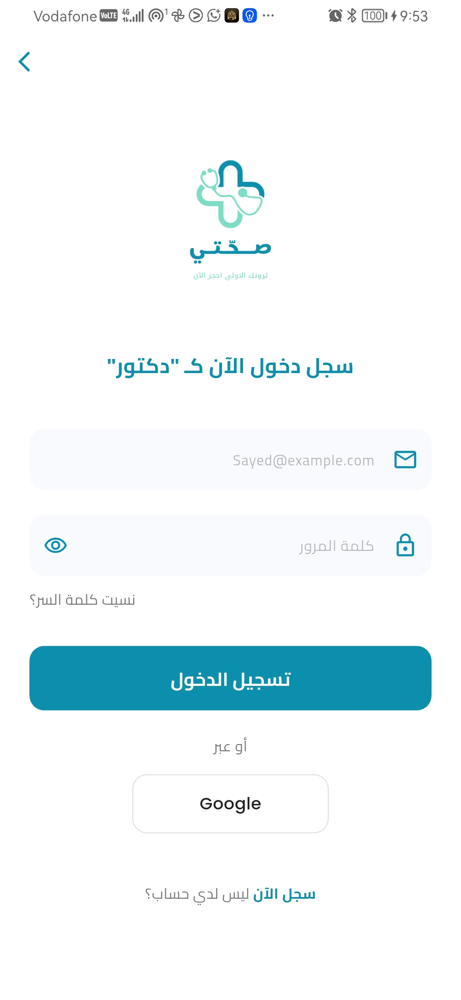
</p>
<p align="center">
  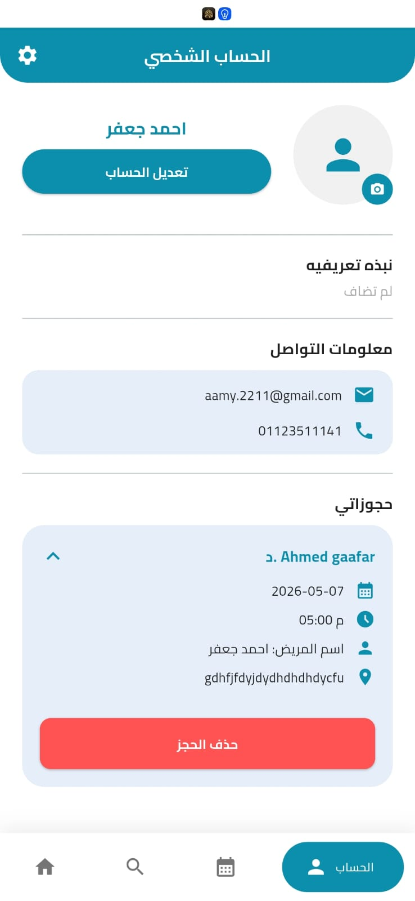
  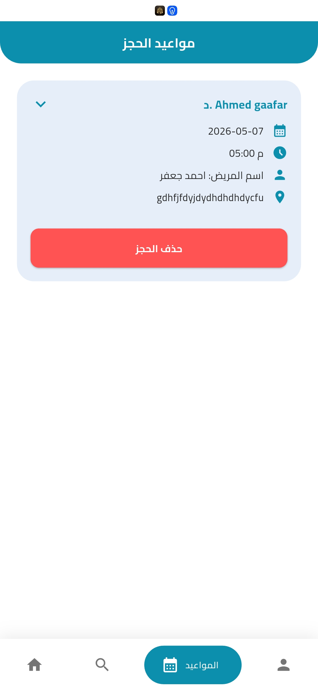
  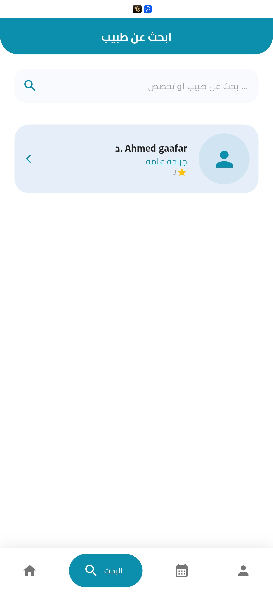
</p>
<p align="center">
  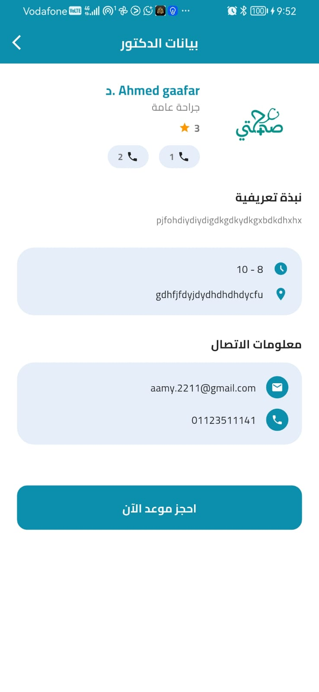
  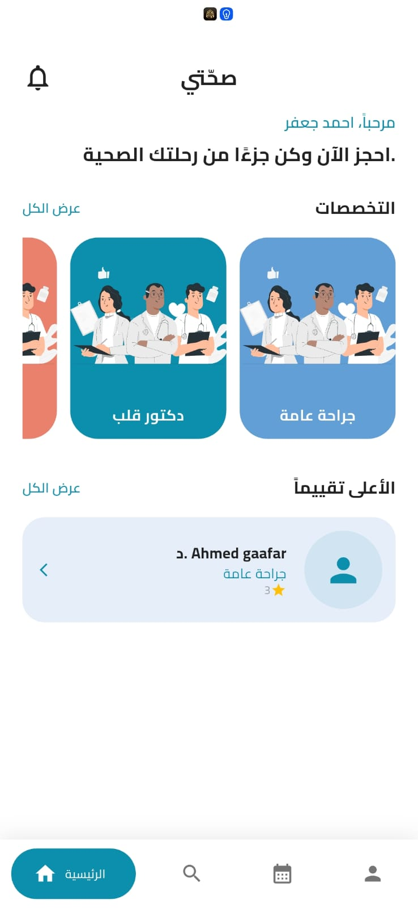
</p>

## 🛠️ Tech Stack & Architecture

- **Framework:** Flutter 💙
- **Language:** Dart
- **Architecture:** Clean Architecture (Feature-based structure separating Data and Presentation layers)
- **State Management:** BLoC (Cubit)
- **Database:** Firebase Cloud Firestore
- **Authentication:** Firebase Authentication
- **Routing:** GoRouter
- **UI Responsiveness:** `flutter_screenutil`

## 🚀 How to Run

1. Clone the repository:
```bash
git clone https://github.com/ahmedgaafar233/se7ety.git
```

2. Install dependencies:
```bash
flutter pub get
```

3. Ensure Firebase is configured (`flutterfire configure`) if you want to run your own instance.

4. Run the app:
```bash
flutter run
```

---

## 💖 Acknowledgments

We would like to express our deepest gratitude to **EraaSoft** for their continuous support and guidance throughout this project.

Special thanks to the amazing engineers who made this possible:
- **Eng. Sayed Abdul-Aziz**
- **Eng. Abdalrahman Nasser**
- **Eng. Anas Ezz**

Your contributions and mentorship have been invaluable!

---
<div align="center">
  <i>Developed with 💙 to provide the best healthcare experience.</i>
</div>
